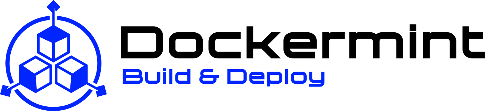

<p align="center">
  
</p>

# Pebblify

[](https://opensource.org/licenses/Apache-2.0)
[](https://dockermint.io/tools)
[](https://go.dev/doc/install)
[](https://github.com/Dockermint/pebblify/releases)
[](https://github.com/Dockermint/pebblify/actions/workflows/ci.yml)
[](https://github.com/orgs/Dockermint/packages/container/package/pebblify)

**Pebblify** is a high-performance migration tool that converts LevelDB databases to PebbleDB format, specifically designed for Cosmos SDK and CometBFT blockchain nodes.

PebbleDB offers significant performance improvements over LevelDB, including better write throughput, more efficient compaction, and reduced storage overhead. Pebblify outperforms existing tools: in a real-world production benchmark it completed a full snapshot conversion in **6m48** versus 7m13 for Level2Pebble, while producing a **20.34 GiB** output compared to 26 GiB, with no data loss. It adds crash recovery, disk space checks, verification, Prometheus metrics, health probes, notifications, and daemon mode that Level2Pebble does not provide.

**[Install now](#installation)** or read the [full documentation](https://docs.dockermint.io/pebblify/).

## Quick Start

### Convert a LevelDB database

```bash
pebblify level-to-pebble ~/.gaia/data ./gaia-pebble
```

### Recover an interrupted conversion

```bash
pebblify recover --tmp-dir /var/tmp
```

### Verify converted data

```bash
pebblify verify --sample 10 ~/.gaia/data ./gaia-pebble/data
```

For all available flags and subcommands, see the [CLI reference](https://docs.dockermint.io/pebblify/).

## Benchmark

Real-world comparison on a production Cosmos node snapshot:

| Metric | LevelDB (native) | [Level2Pebble](https://github.com/notional-labs/level2pebble) | Pebblify |
|---|---|---|---|
| Size | 25 GiB | 26 GiB | **20.34 GiB** |
| Duration | -- | 7m13 | **6m48** |
| DB performance | average | good | good |
| Full snapshot conversion | -- | ❌ | ✅ |
| Disk space checks | -- | ❌ | ✅ |
| Prometheus metrics | -- | ❌ | ✅ |
| Probes | -- | ❌ | ✅ |
| Resume on error | -- | ❌ | ✅ |
| Verification | -- | ❌ | ✅ |
| Daemon mode | -- | ❌ | ✅ |
| Notifications* | -- | ❌ | ✅ |
| Push* | -- | ❌ | ✅ |

\* Daemon mode only.

## Features

- **Fast parallel conversion** -- Process multiple databases concurrently with configurable worker count
- **Crash recovery** -- Resume interrupted migrations from the last checkpoint
- **Adaptive batching** -- Automatically adjusts batch sizes based on memory constraints
- **Real-time progress** -- Live progress bar with throughput metrics and ETA
- **Data verification** -- Verify converted data integrity with configurable sampling
- **Disk space checks** -- Pre-flight validation to ensure sufficient storage
- **Docker support** -- Multi-architecture container images (amd64/arm64)
- **Health probes** -- HTTP liveness, readiness, and startup endpoints for orchestrators
- **Prometheus metrics** -- Opt-in metrics exporter for conversion monitoring
- **Shell completion** -- Bash and zsh autocompletion via `pebblify completion`

## Installation

### Docker / Podman (recommended)

> [!TIP]
> Podman is rootless, giving it a security advantage over Docker.

**Prerequisites:** [Docker](https://docs.docker.com/get-docker/) or [Podman](https://podman.io/docs/installation).

```bash
# Pull the image
docker pull ghcr.io/dockermint/pebblify:0.4.0
podman pull ghcr.io/dockermint/pebblify:0.4.0

# Run a conversion
docker run --rm \
  -v /path/to/source:/data/source:ro \
  -v /path/to/output:/data/output \
  -v /path/to/tmp:/tmp \
  ghcr.io/dockermint/pebblify:0.4.0 \
  level-to-pebble --health --metrics /data/source /data/output

podman run --rm \
  -v /path/to/source:/data/source:ro \
  -v /path/to/output:/data/output \
  -v /path/to/tmp:/tmp \
  ghcr.io/dockermint/pebblify:0.4.0 \
  level-to-pebble --health --metrics /data/source /data/output
```

### Binary

Download a pre-built binary for your platform from the [v0.4.0 release page](https://github.com/Dockermint/pebblify/releases/tag/v0.4.0).

Available architectures: Linux/AMD64, Linux/ARM64, Darwin/ARM64, Darwin/AMD64.

After downloading, verify the checksum against the `checksums.txt` file on the release page, then place the binary on your `PATH`.

### Build from source

> [!NOTE]
> **Prerequisites:** [Go 1.25+](https://go.dev/doc/install), `make`, `git`.
>
> Per-platform Makefile targets:
> - `install-cli` -- build and install the CLI binary to your `PATH` (all platforms)
> - `build-docker` -- build a Docker image for the local platform
> - `install-systemd-daemon` -- install the daemon as a systemd service (Linux only, requires root)
> - `install-podman` -- install the daemon as a rootless Podman Quadlet (Linux only)

```bash
git clone --branch v0.4.0 https://github.com/Dockermint/pebblify.git
cd pebblify
make install-cli
```

For daemon and container installation options, see the [installation guide](https://docs.dockermint.io/pebblify/).

## Daemon mode

> [!WARNING]
> The daemon mode is currently in **beta**. If you encounter a bug, please [open an issue](https://github.com/Dockermint/pebblify/issues/new/choose).

`pebblify daemon` is a long-running HTTP service that accepts snapshot archive URLs, converts them from LevelDB to PebbleDB format, repacks the output, and saves it to one or more storage targets (local directory, SCP, S3). Jobs are submitted via a REST API and processed serially.

**Platform:** The `daemon` subcommand is Linux-only at runtime. On macOS, use Docker Compose or Podman.

```bash
# Set the API token
export PEBBLIFY_BASIC_AUTH_TOKEN="your-secret-token-here"

# Start the daemon (Linux only)
pebblify daemon

# Submit a job
curl -s -X POST http://127.0.0.1:2324/v1/jobs \
  -u "ignored:${PEBBLIFY_BASIC_AUTH_TOKEN}" \
  -H "Content-Type: application/json" \
  -d '{"url": "https://snapshots.example.com/gaia-snapshot.tar.lz4"}'
```

> **macOS users:** Run the daemon via Docker Compose (`docker compose -f docker-compose.daemon.yml up -d`) or Podman Desktop. See [daemon quickstart](docs/markdown/daemon-quickstart.md).

Full guide: [docs/markdown/daemon-quickstart.md](docs/markdown/daemon-quickstart.md)

## Systemd daemon (Linux only)

Installs the daemon as a system service. Requires root. Not supported on macOS.

```bash
sudo make install-systemd-daemon
```

After installation, fill in `/etc/pebblify/.env`, then:

```bash
sudo systemctl daemon-reload
sudo systemctl enable --now pebblify
```

See [daemon quickstart](docs/markdown/daemon-quickstart.md) for the full setup guide.

## Podman Quadlet (rootless)

Deploys the daemon as a rootless Podman container managed by the systemd user session. Linux-native; macOS users need Podman Desktop.

```bash
make install-podman
```

After installation:

```bash
systemctl --user daemon-reload
systemctl --user start pebblify
```

## Performance Tips

- **Use SSDs** -- NVMe storage significantly improves conversion speed
- **Increase workers** -- For systems with many CPU cores, increase `-w` for faster parallel processing
- **Adjust batch memory** -- Increase `--batch-memory` if you have RAM to spare
- **Use local temp** -- If `/tmp` is a tmpfs (RAM-based), use `--tmp-dir` to point to disk storage for large datasets

## Requirements

- **Go 1.25+** (for building from source)
- **Sufficient disk space** -- Approximately 1.5x the source data size during conversion
- **Source database** -- Valid LevelDB directory structure (Cosmos/CometBFT `data/` format)

## Contributing

Contributions are welcome. Please submit issues and pull requests via [GitHub](https://github.com/Dockermint/pebblify).

## License

This project is licensed under the Apache License 2.0. See the [LICENSE](LICENCE) file for details.

## Acknowledgments

- [CockroachDB Pebble](https://github.com/cockroachdb/pebble) -- The high-performance storage engine
- [syndtr/goleveldb](https://github.com/syndtr/goleveldb) -- LevelDB implementation in Go
